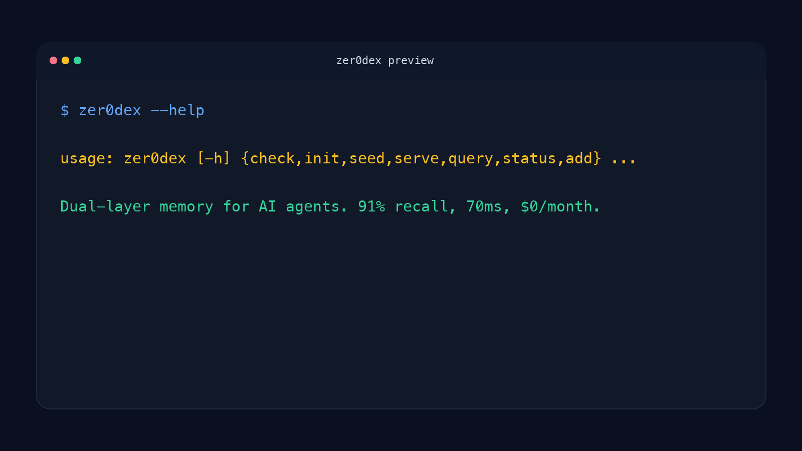

# zer0dex

Long-running agents forget what matters because either everything is stuffed into one flat memory file or everything is left floating in a vector store with no map.

`zer0dex` is a local dual-layer memory pattern for AI agents: a compressed markdown memory index plus a vector store that is queried automatically before each message.

- "My agent technically has memory, but it still forgets cross-project context."
- "Vector search finds facts, but not how those facts relate to each other."
- "A giant MEMORY.md is cheap, but the agent still has to guess what matters."
- "I want local agent memory without a hosted memory product or another orchestration stack."

```bash
pip install zer0dex
```

```bash
zer0dex --help
```

```text
usage: zer0dex [-h] {check,init,seed,serve,query,status,add} ...

Dual-layer memory for AI agents. 91% recall, 70ms, $0/month.
```

**When To Use It**

Use `zer0dex` when you want a local persistent-memory layer for agents that need both fast recall and a lightweight human-readable index for cross-reference and navigation.

**When Not To Use It**

Do not use `zer0dex` if you need a hosted memory service, automatic policy governance, or proof that the benchmark will transfer unchanged to every workload. It is a local memory architecture and reference implementation.



[](https://pypi.org/project/zer0dex/)
[](https://pypi.org/project/zer0dex/)
[](https://github.com/hermes-labs-ai/zer0dex)
[](https://github.com/hermes-labs-ai/zer0dex/blob/main/LICENSE)
[](https://pypi.org/project/zer0dex/)
[](https://github.com/hermes-labs-ai/zer0dex/actions/workflows/ci.yml)

**A token-efficient memory architecture for persistent AI agents.**

zer0dex combines a compressed human-readable index with a local vector store to give AI agents long-term memory that outperforms both flat files and traditional RAG.

## Results (n=97)

| Architecture | Recall | ≥75% Pass Rate | Cross-Reference |
|---|---|---|---|
| Flat File Only | 52.2% | 41% | 70.0% |
| Full RAG | 80.3% | 77% | 37.5% |
| **zer0dex** | **91.2%** | **87%** | **80.0%** |

**Zero losses** in head-to-head comparison. 70ms latency. $0/month (fully local).

## The Problem

Persistent AI agents need memory across sessions. Current approaches all have gaps:

- **Flat files** (MEMORY.md, etc.) — cheap on tokens but poor retrieval. The agent has to "know what it knows."
- **Full RAG** (vector store only) — good retrieval but poor cross-referencing. Facts are "floating" with no structure.
- **MemGPT/Letta** — powerful but complex. The LLM manages its own memory paging, adding latency and cost.

## The Architecture

zer0dex uses two layers:

### Layer 1: Compressed Index (MEMORY.md)

A human-readable markdown file (~3KB) that acts as a **semantic table of contents**. It tells the agent *what categories of knowledge exist* without storing full details.

```markdown
## Products
- **Little Canary** — prompt injection detection, 99% on TensorTrust
- mem0 topics: Little Canary, prompt injection, HERM
```

This index is always in context (~782 tokens). It provides **navigational scaffolding** — the agent knows where knowledge lives.

### Layer 2: Vector Store (mem0 + chromadb)

A semantic fact store containing extracted details from daily logs, conversations, and curated notes. Queried via embedding similarity on every inbound message.

### The Hook: Automatic Pre-Message Injection

A lightweight HTTP server keeps the vector store warm in memory. Every inbound message triggers a semantic query (70ms), and the top 5 relevant memories are injected into the agent's context automatically. No judgment call. No forgetting.

```
User: "How's the Suy Sideguy deployment going?"
    ↓
Hook queries mem0 → finds: "Suy: watching PID 76977, qwen3:4b judge"
    ↓
Agent sees: [message] + [Suy context from mem0] + [MEMORY.md index]
    ↓
Agent responds with specific details it otherwise wouldn't have
```

## Why It Works

The compressed index solves the **cross-reference problem**. When a user asks "How does X relate to Y?", vector similarity finds X *or* Y, rarely both. But the compressed index contains cross-domain pointers — it's like a hyperlinked table of contents. The LLM uses the index to bridge domains that vector similarity alone can't connect.

| Query Type | Full RAG | zer0dex | Gap |
|---|---|---|---|
| Direct recall | 84.3% | 92.1% | +7.8pp |
| Cross-reference | 37.5% | 80.0% | **+42.5pp** |
| Negative (rejection) | 100% | 100% | 0pp |

## Quick Start

### Requirements

- Python 3.11+
- [Ollama](https://ollama.ai) with `nomic-embed-text` and `mistral:7b`
- 8GB+ RAM

### Install

```bash
pip install zer0dex

# Pull embedding + extraction models
ollama pull nomic-embed-text
ollama pull mistral:7b
```

### 1. Create Your Compressed Index

Create a `MEMORY.md` file — a compressed summary of what your agent knows:

```markdown
# Agent Memory Index

## User
- Name: Alice
- Role: ML Engineer
- Topics in mem0: Alice, preferences, projects

## Projects
- **ProjectX** — NLP pipeline, deadline March 15
- Topics in mem0: ProjectX, NLP, deadlines
```

### 2. Initialize and Seed

```bash
zer0dex init
zer0dex check          # validate Ollama, models, deps
zer0dex seed --source MEMORY.md --source memory/
```

### 3. Start the Memory Server

```bash
zer0dex serve
```

### 4. Integrate with Your Agent

The server exposes a simple HTTP API:

```bash
# Query
curl -X POST http://localhost:18420/query \
  -H "Content-Type: application/json" \
  -d '{"text": "What is ProjectX?", "limit": 5}'

# Add memory
curl -X POST http://localhost:18420/add \
  -H "Content-Type: application/json" \
  -d '{"text": "ProjectX deadline moved to March 20"}'

# Health check
curl http://localhost:18420/health
```

For automatic injection, add a pre-message hook in your agent framework that queries the server before every LLM call.

## Evaluation

Run the evaluation suite yourself:

```bash
python eval/evaluate.py --memories 86 --test-cases 97
```

See [eval/README.md](eval/README.md) for methodology and detailed results.

## Architecture Diagram

```
┌─────────────────────────────────────────────────┐
│                  Agent Context                   │
│                                                  │
│  ┌──────────────┐    ┌───────────────────────┐   │
│  │  MEMORY.md   │    │   mem0 Results (auto)  │  │
│  │  (compressed  │    │   [injected by hook]   │  │
│  │   index)      │    │                        │  │
│  │  ~782 tokens  │    │   ~104 tokens          │  │
│  └──────────────┘    └───────────────────────┘   │
│         ↑                       ↑                │
│    Always loaded          Pre-message hook        │
│    at session start       queries on every msg    │
└─────────────────────────────────────────────────┘
                              ↑
                    ┌─────────────────┐
                    │  mem0 HTTP Server │
                    │  (port 18420)     │
                    │  70ms avg query   │
                    └─────────────────┘
                              ↑
                    ┌─────────────────┐
                    │    chromadb      │
                    │  (local vector   │
                    │   store)         │
                    └─────────────────┘
```

## How It Compares

| Feature | Flat Files | Full RAG | MemGPT/Letta | **zer0dex** |
|---|---|---|---|---|
| Recall | 52% | 80% | ~80%* | **91%** |
| Cross-reference | 70% | 38% | Unknown | **80%** |
| Latency | 0ms | ~15ms | ~500ms+ | **70ms** |
| Token overhead | 782 | 104 | Variable | **886** |
| Cost/month | $0 | $0-50 | $0-50 | **$0** |
| Complexity | Trivial | Moderate | High | **Low** |
| Auto-retrieval | No | On-demand | LLM-managed | **Every message** |

*MemGPT recall estimated; no published head-to-head comparison available.

If zer0dex is useful to you, please [star the repo](https://github.com/hermes-labs-ai/zer0dex) — it helps others find it.

## Citation

```bibtex
@misc{bosch2026zer0dex,
  title={zer0dex: Dual-Layer Memory Architecture for Persistent AI Agents},
  author={Bosch, Rolando},
  year={2026},
  url={https://github.com/hermes-labs-ai/zer0dex}
}
```

## License

Apache 2.0

## Credits

Uses [mem0](https://mem0.ai) for vector storage, [chromadb](https://www.trychroma.com/) for the vector database, and [Ollama](https://ollama.ai) for local embeddings and extraction.

---

## About Hermes Labs

[Hermes Labs](https://hermes-labs.ai) builds AI audit infrastructure for enterprise AI systems — EU AI Act readiness, ISO 42001 evidence bundles, continuous compliance monitoring, agent-level risk testing. We work with teams shipping AI into regulated environments.

**Our OSS philosophy — read this if you're deciding whether to depend on us:**

- **Everything we release is free, forever.** MIT or Apache-2.0. No "open core," no SaaS tier upsell, no paid version with the features you actually need. You can run this repo commercially, without talking to us.
- **We open-source our own infrastructure.** The tools we release are what Hermes Labs uses internally — we don't publish demo code, we publish production code.
- **We sell audit work, not licenses.** If you want an ANNEX-IV pack, an ISO 42001 evidence bundle, gap analysis against the EU AI Act, or agent-level red-teaming delivered as a report, that's at [hermes-labs.ai](https://hermes-labs.ai). If you just want the code to run it yourself, it's right here.

**The Hermes Labs OSS audit stack** (public, production-grade, no SaaS):

**Static audit** (before deployment)
- [**lintlang**](https://github.com/hermes-labs-ai/lintlang) — Static linter for AI agent configs, tool descriptions, system prompts. `pip install lintlang`
- [**rule-audit**](https://github.com/hermes-labs-ai/rule-audit) — Static prompt audit — contradictions, coverage gaps, priority ambiguities
- [**scaffold-lint**](https://github.com/hermes-labs-ai/scaffold-lint) — Scaffold budget + technique stacking. `pip install scaffold-lint`
- [**intent-verify**](https://github.com/hermes-labs-ai/intent-verify) — Repo intent verification + spec-drift checks

**Runtime observability** (while the agent runs)
- [**little-canary**](https://github.com/hermes-labs-ai/little-canary) — Prompt injection detection via sacrificial canary-model probes
- [**suy-sideguy**](https://github.com/hermes-labs-ai/suy-sideguy) — Runtime policy guard — user-space enforcement + forensic reports
- [**colony-probe**](https://github.com/hermes-labs-ai/colony-probe) — Prompt confidentiality audit — detects system-prompt reconstruction

**Regression & scoring** (to prove what changed)
- [**hermes-jailbench**](https://github.com/hermes-labs-ai/hermes-jailbench) — Jailbreak regression benchmark. `pip install hermes-jailbench`
- [**agent-convergence-scorer**](https://github.com/hermes-labs-ai/agent-convergence-scorer) — Score how similar N agent outputs are. `pip install agent-convergence-scorer`

**Supporting infra**
- [**claude-router**](https://github.com/hermes-labs-ai/claude-router) · [**forgetted**](https://github.com/hermes-labs-ai/forgetted) · [**quick-gate-python**](https://github.com/hermes-labs-ai/quick-gate-python) · [**quick-gate-js**](https://github.com/hermes-labs-ai/quick-gate-js) · [**repo-audit**](https://github.com/hermes-labs-ai/repo-audit)
