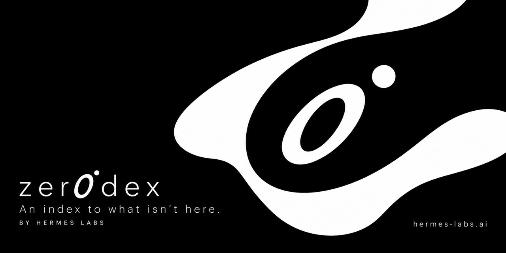

<div align="center">

<picture>
  <source media="(prefers-color-scheme: dark)" srcset="assets/zer0dex-hero-white-background.jpg">
  <source media="(prefers-color-scheme: light)" srcset="assets/zer0dex-hero-black-background.jpg">
  
</picture>

# zer0dex

**Give an agent long-term recall without loading every note into its prompt.**

A readable Markdown index shows what the agent knows. A local vector store retrieves the details when they matter.

by [Hermes Labs](https://hermes-labs.ai)

[PyPI](https://pypi.org/project/zer0dex/) · [CLI reference](docs/cli.md) · [HTTP API](docs/http.md)

</div>

Your agent knows the project name, but the deployment decision it needs is buried in months of notes. Putting the entire archive in its context is expensive and hard to navigate; a vector store alone gives you no simple map of what's in it. zer0dex pairs a short index you can read and edit with semantic search over the underlying memories.

## Try it locally

Requires Python 3.11 or 3.12 and [Ollama](https://ollama.com/) running on your machine. Start Ollama first if it is not already serving at `http://localhost:11434`.

```bash
mkdir zer0dex-demo && cd zer0dex-demo
python3 -m venv .venv
source .venv/bin/activate
python -m pip install zer0dex
ollama pull nomic-embed-text
ollama pull mistral:7b

printf '# Memory\n## Project Atlas\n- Deployment target: staging\n' > MEMORY.md
zer0dex check
zer0dex init
zer0dex seed --source MEMORY.md
zer0dex serve --background
zer0dex query "Where does Project Atlas deploy?"
```

The last command returns matching stored memories if extraction and retrieval succeeded. Run `zer0dex stop` when finished. The configuration and store live in the current directory (`.zer0dex.json` and `.zer0dex/`); use a disposable directory for a trial. If `check` fails, confirm that Ollama is running and both models were pulled before seeding.

## How the two layers work

| Layer | What it gives you |
| --- | --- |
| Markdown index | A compact, human-editable map of projects, categories, and durable pointers. Keep this in the agent's context. |
| Local memory store | The fuller details, retrieved by meaning when the agent needs them. |

The CLI can seed memories from Markdown, add more text, and query a loopback HTTP server. Your agent host calls `POST /query` before a model request and decides which matches to include. **zer0dex supplies the server and CLI; it does not install an automatic hook into your agent.** A small [TypeScript host adapter](src/zer0dex/hook_example.ts) shows that integration point.

The default path uses local Ollama models for embeddings and memory extraction, with mem0 and Chroma for storage. You can inspect the index directly and keep the retrieval store on your machine.

## When to use it

zer0dex is a fit for developers building a local, long-running agent whose notes have outgrown one `MEMORY.md`, but who still want a readable map of what was saved. It is a reference implementation of this two-layer pattern, currently in the 0.1.x developer-preview line. The package is not a hosted team service or a complete agent framework.

In the [bundled 86-memory, 97-case evaluation](eval/README.md), the combined approach reached 91.2% average recall and 80.0% cross-reference recall. This is one test workload; try your own notes and queries before choosing a retrieval strategy.

## Go further

- [CLI commands and defaults](docs/cli.md)
- [HTTP endpoints and response fields](docs/http.md)
- [Compatibility and migration policy](docs/compatibility.md)
- [Evaluation and methodology](eval/README.md)
- [Contributing](CONTRIBUTING.md) · [Changelog](CHANGELOG.md)

Apache-2.0. [Hermes Labs](https://hermes-labs.ai) builds agentic infrastructure for autonomous systems.
