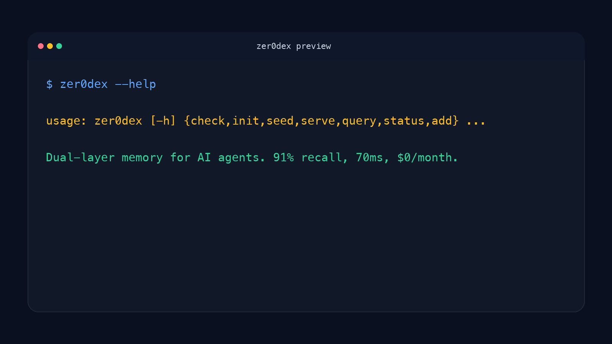

# zer0dex

Give a long-running agent local recall without forcing every detail into its
prompt: `zer0dex` pairs a small, human-readable memory index with semantic
retrieval from a local vector store.

[](https://pypi.org/project/zer0dex/)
[](https://pypi.org/project/zer0dex/)
[](https://github.com/hermes-labs-ai/zer0dex/actions/workflows/ci.yml)
[](LICENSE)

**0.1.0 is the first supported developer-preview line.** The project remains
Alpha: expect refinement, but migration notes will precede documented breaking
changes during the 0.1.x line. See the [compatibility policy](docs/compatibility.md).



## Who needs it

`zer0dex` is for agent and framework developers who:

- run agents locally and need memory to persist across sessions;
- want a compact index that people can inspect and edit;
- need semantic retrieval for details that do not fit in that index; and
- can add one local HTTP lookup before a model call.

It is especially useful when a flat `MEMORY.md` has become too large, while a
vector store alone makes it hard to see what knowledge exists or how topics
relate.

## Why two layers

The markdown layer is a semantic table of contents: keep categories, durable
summaries, and cross-topic pointers there. The local mem0/Chroma layer holds the
retrievable details. Your agent host keeps the index in context and queries the
HTTP server for the current message, then decides how to inject the returned
matches.

The package supplies the CLI and local server. It does not install or run a
pre-message hook; wiring the query into model calls remains an agent-host step.

## First success

Requirements and tested support:

- Python 3.11 or 3.12 (the package declares Python 3.11+; later versions are
  not yet covered by CI);
- [Ollama](https://ollama.com/) installed and serving locally at
  `http://localhost:11434`;
- the local `nomic-embed-text` and `mistral:7b` Ollama models; and
- enough local memory and disk for those models and the Chroma store.

The package install includes mem0ai, ChromaDB, and the Ollama Python client. The
default path requires no hosted memory service or cloud API key.

```bash
python -m venv .venv
source .venv/bin/activate
pip install zer0dex

ollama pull nomic-embed-text
ollama pull mistral:7b

printf '%s\n' '# Memory' '## Project Atlas' '- Deployment target: staging' > MEMORY.md
zer0dex check
zer0dex init
zer0dex seed --source MEMORY.md
zer0dex serve --background
zer0dex query "Where does Project Atlas deploy?"
zer0dex add "Project Atlas deploys from the release branch"
zer0dex status
```

This creates `.zer0dex.json` and a local `.zer0dex/` store in the working
directory. Stop the background server using your operating system's process
controls when finished.

## Integration surface

The shortest host integration is an HTTP `POST /query` before each model call.
Use the returned `memories` as additional context according to your own prompt
and trust policy. The server also exposes `POST /add` and `GET /health`.

Exact commands, options, response fields, errors, and compatibility promises
live in the reference documentation:

- [CLI reference](docs/cli.md)
- [HTTP API reference](docs/http.md)
- [Compatibility and migration policy](docs/compatibility.md)
- [Evaluation methodology, results, and limitations](eval/README.md)

## Evidence and limits

The bundled evaluation compares a compressed index, vector retrieval, and the
dual-layer combination on one 86-memory, 97-case workload. In that workload,
zer0dex reached 91.2% average recall and 80.0% cross-reference recall.

Those figures are workload evidence, not a general performance guarantee. The
evaluation uses one memory store, cases derived from that store, a single-run
score without confidence intervals, and hardware-specific latency. It does not
establish behavior at thousands of memories, across domains, or inside your
agent's prompt and tool stack. Re-run the evaluation on representative data
before choosing thresholds or making production claims.

## Non-goals

zer0dex is not:

- hosted memory infrastructure or a multi-tenant service;
- a complete agent framework or automatic hook installer;
- a compliance, access-control, privacy, or governance system;
- a guarantee that retrieved text is true, safe, or appropriate to inject; or
- evidence that the bundled benchmark transfers unchanged to another workload.

Treat source documents and retrieved memories as data with the same sensitivity
and trust boundaries you apply elsewhere in your agent.

## Development

```bash
git clone https://github.com/hermes-labs-ai/zer0dex.git
cd zer0dex
python -m venv .venv
source .venv/bin/activate
pip install -e ".[dev]"
python -m pytest tests/ -q
```

See [CONTRIBUTING.md](CONTRIBUTING.md) for contribution guidance and
[CHANGELOG.md](CHANGELOG.md) for release history.

## Citation

```bibtex
@misc{bosch2026zer0dex,
  title={zer0dex: Dual-Layer Memory Architecture for Persistent AI Agents},
  author={Bosch, Rolando},
  year={2026},
  url={https://github.com/hermes-labs-ai/zer0dex}
}
```

## License and credits

Apache-2.0. zer0dex uses [mem0](https://mem0.ai/) for the memory abstraction,
[Chroma](https://www.trychroma.com/) for local vector storage, and
[Ollama](https://ollama.com/) for local embedding and extraction models.

zer0dex is maintained by [Hermes Labs](https://hermes-labs.ai/), an independent
AI reliability research lab.
